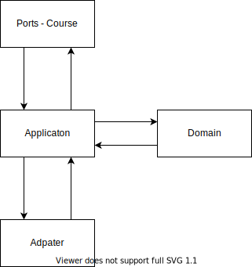

# Hexagonal Architecture
## also known as Onion Architecture or Ports and Adapters Architecture

To compare the architecture to a 3-layer-architecuter, the hexagon-architecture mostly move the buissness logic to the domain.

### Ports - Request from other tools

> Translate incoming request to Application layer and out going data from Application layer

Ports are adapter to translate incoming requests to the application layer and calls the necassery application function. Each route will be a differnt port. Do not have to be fixed to API, also other types will be possible. There could be also different Ports for the same data but other return types like json or xml.

### Adapters - Datarequest to other sources

Adapter care about the data request to other resources like databases or other APIs.
In this example each Application class have one data Adapter, this means the Application do not know from wich or how much sources the data came from. So if some data will be moved to an other source only the adapter have to be changed.

### Domain - Main logic

> seperate unique easy to test block, that onyl follow logical conditions and bind methods to the outer world

The Domain cares about the main logic. Abstact the functionality and should not think about Data or Request logic. It is pure logic wihtout any framework.
This Block should work without any others tool. So for this example you have interactions like creating a course. This is just a call and no other tools or adapter have to be given to the domain, just values and object that are still included in the domain.

Could be used to build a monolith but could be also split in smaller parts with a tematical abstraction layer. In this expamle, a course need also Users, but only a small part of user, like the name. The permission are spezific for courses.

### Application - Use Cases

> Getting everthing together and asptract the domain from the others layers

This is something like a coordinator, that takes the data from the request and request more data data from adapter if necassery and give them to the domain, to validate main logic. If ervery thing is ok it could give data back to the ports layer got the request.

If the application layer need more data to fulfill the request, it needs to be initaliest with an adapter. Makes it alitle bit more complicate to tests but, could also be simple tests that mocks the adpater.
